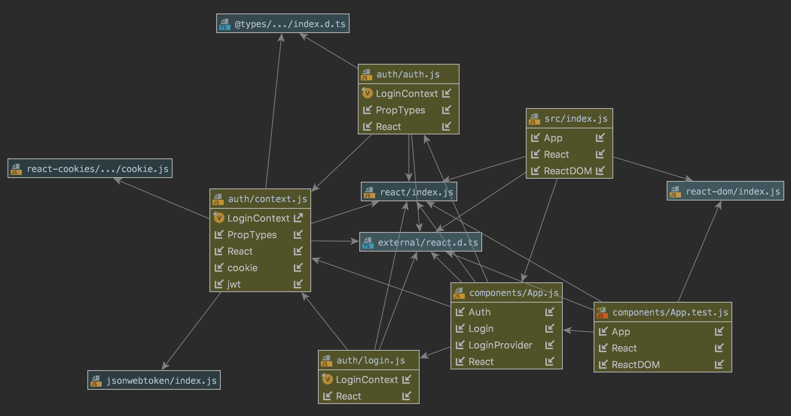

# Week 8 Project 

## Front-end Server (React)

### Author: Austin Hedeen

### Links and Resources
* [Front-end Deployment](https://gallant-borg-966b80.netlify.com/)
* [Travis](https://travis-ci.com/austinhedeen-401-advanced-javascript/week-8-front-end)
* [PR - Day 1 (Setup/Config)](https://github.com/austinhedeen-401-advanced-javascript/week-8-back-end/pull/1)
* [PR - Day 2 (React Auth)](https://github.com/austinhedeen-401-advanced-javascript/week-8-back-end/pull/2)

#### Documentation
* [styleguide](https://stupefied-goldstine-b40abe.netlify.com/)

#### Running the development app
* `npm start`
  
#### Tests
* `npm test`

#### UML

